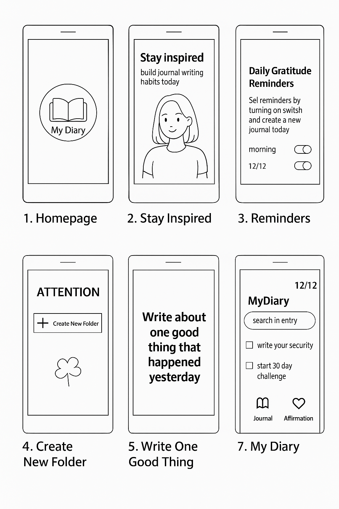
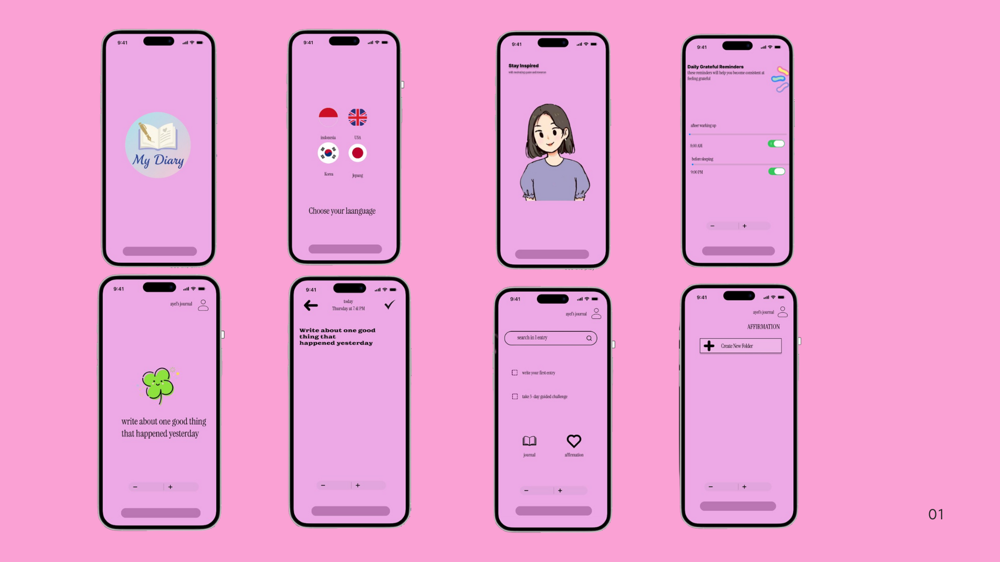
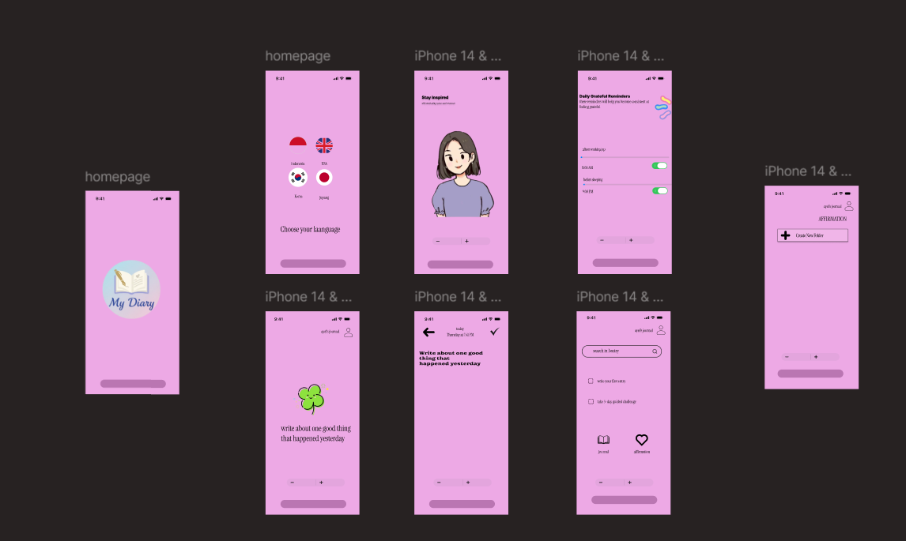

# 📔 My Diary App
**Dibuat oleh:** Adellia Rezqi Salmabillah  
**Program Studi:** Teknik Informatika  
**Universitas Pelita Bangsa**  
**Tahun:** 2025  

---

##  Deskripsi Aplikasi

Aplikasi **My Diary** adalah aplikasi jurnal harian yang membantu pengguna menulis hal-hal baik yang terjadi setiap hari serta membangun kebiasaan bersyukur melalui afirmasi dan pengingat positif.

---

##  Fitur Utama

-  **Splash Screen Multibahasa** — pengguna memilih bahasa dengan ikon bendera.
-  **Homepage** — tampilan logo utama aplikasi “My Diary”.
-  **Stay Inspired** — menampilkan motivasi harian untuk menulis jurnal.
-  **Daily Reminders** — pengingat harian agar tidak lupa menulis jurnal.
-  **Create New Folder** — menambah folder baru untuk kategori jurnal.
-  **Write One Good Thing** — menulis satu hal baik yang terjadi kemarin.
-  **My Diary Page** — menampilkan entri jurnal dan afirmasi pengguna.

---

##  1. Storyboard

Berikut adalah alur storyboard aplikasi *My Diary*, menampilkan urutan interaksi dari awal membuka aplikasi hingga halaman utama.

---

##  2. Mockup Desain

Mockup menampilkan desain berwarna dari setiap halaman aplikasi dengan nuansa pink lembut dan elemen visual yang konsisten.

---

##  3. Wireframe

Wireframe menggambarkan struktur dasar tampilan tanpa warna, untuk mempermudah tahap perancangan sebelum desain akhir dibuat.

---

##  Alur Navigasi Aplikasi

1. **Splash Screen** → Pilih bahasa yang diinginkan.  
2. **Homepage** → Logo aplikasi tampil sebagai pembuka.  
3. **Stay Inspired** → Motivasi harian ditampilkan.  
4. **Reminders** → Pengguna mengatur waktu pengingat menulis.  
5. **Create New Folder** → Tambahkan folder baru untuk catatan.  
6. **Write One Good Thing** → Tulis satu hal baik yang terjadi.  
7. **My Diary Page** → Lihat semua entri dan afirmasi.

---

##  Catatan Akhir

File ini berisi dokumentasi visual untuk perancangan aplikasi *My Diary* yang dibuat menggunakan **Figma** dan **Canva**.  
Proyek ini bertujuan untuk memahami proses UI/UX dari tahap **wireframe → mockup → storyboard**, hingga terbentuk desain akhir aplikasi yang interaktif dan menarik.
